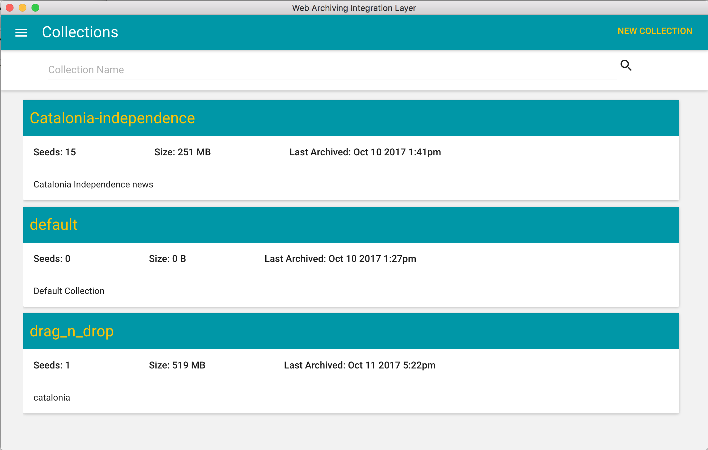
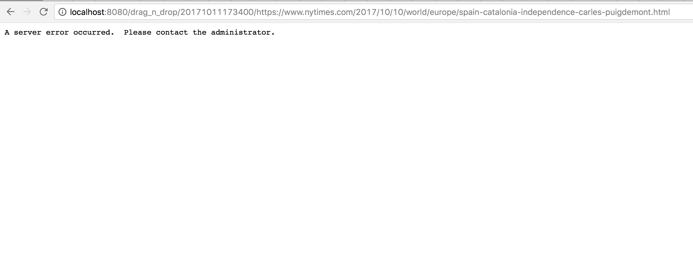
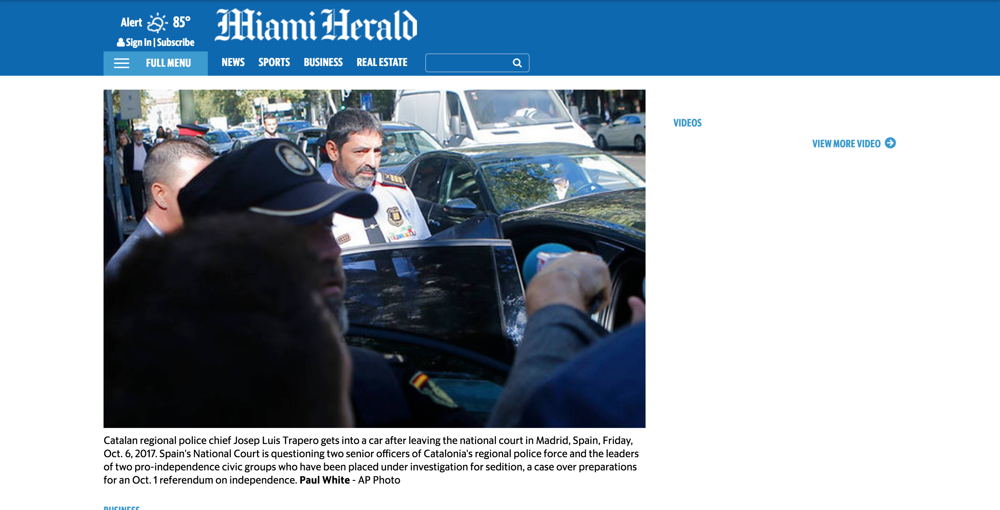
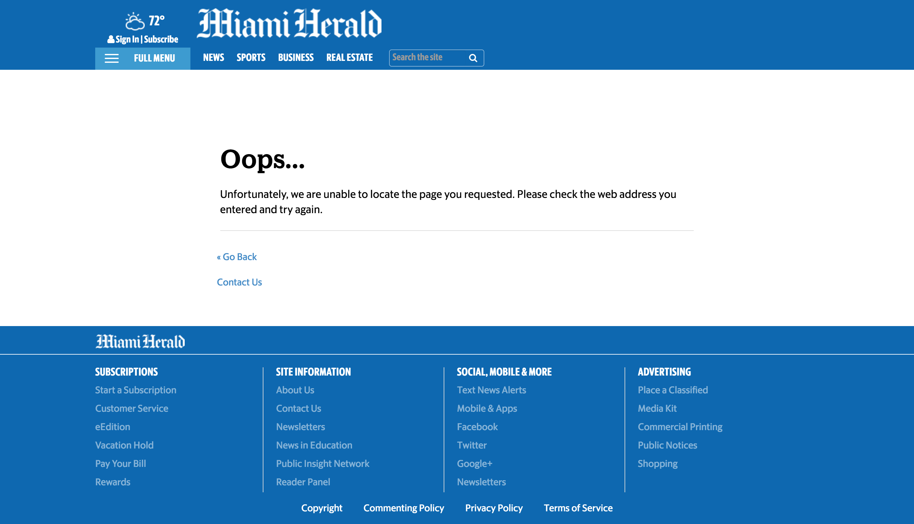

# Tools Review

This document is here to provide feedback on the following web archiving tools:
- [Archive-it](https://archive-it.org/collections/9554)
- [webrecorder.io](https://webrecorder.io/grantat/catalonia-independence)
- WAIL
- WARCreate / Wail

Below each tool is listed with the advantages, disadvantages, and special situations to prefer one tool over another. For each of these tools I used 15 of the following seeds, or starting points.

- http://www.miamiherald.com/news/business/article177373796.html
- http://www.cbc.ca/news/business/spain-catalonia-companies-1.4343429
- http://www.cityam.com/273482/businesses-eye-exit-catalonia-leaders-mull-declaration/
- https://www.nytimes.com/2017/10/01/world/europe/catalonia-independence-referendum.html
- http://www.independent.co.uk/news/world/europe/catalan-independence-referendum-people-hurt-clashes-police-violence-barcelona-a7977646.html
- http://money.cnn.com/2017/09/29/news/economy/catalonia-independence-spain-economy/index.html
- http://www.express.co.uk/news/world/864442/catalonia-latest-news-catalan-speech-declare-independence/
- https://www.theguardian.com/world/2017/oct/08/catalonia-demo-injuries-fact-checking/
- https://www.ft.com/content/138164a6-5b8a-11e7-b553-e2df1b0c3220/
- http://www.bbc.com/news/world-europe-41551337/
- http://www.bbc.com/news/world-europe-29478415/
- https://www.nytimes.com/2017/10/10/world/europe/spain-catalonia-independence-carles-puigdemont.html
- https://www.theguardian.com/world/live/2017/oct/10/catalan-parliament-discusses-independence-referendum-live/
- http://www.cnn.com/2017/10/10/europe/catalonia-how-we-got-here/index.html
- http://www.telegraph.co.uk/news/2017/10/10/spain-braced-possible-catalonian-independence-declaration/

## Archive-it

The collection I created using this archiving tool can be found in collection [9554](https://archive-it.org/collections/9554).
I'd have to say this is my favorite tool overall as it provided a unique simplicity of just starting it and letting it run, where I wouldn't have to depend on my local machine.

### Advantages

- Not dependent on local machine
- Start and walk away without worrying
- Automatically prevents duplicate pages and multimedia
- Allows scheduling of crawls
- Crawl depth options for all seeds

### Disadvantages

- Its necessary to block content thats unwanted (e.g. robots.txt, .mp4, etc)
- Doesn't ignore robots.txt unless specified
- Requires a bit of work for large number of seeds to block content

### Situations to prefer this tool

In a hierarchy I would put this tool at the top of the four listed.
Its simple, can start and on stop based on a schedule, and is independent of a user's local computer. I would prefer this tool over others if I wanted to get as much content as possible starting from a specified from a seed.

## Webrecorder.io

This was a really interesting tool that I had difficulty with at first but I really ended up liking it.

### Advantages

- Can render pages from native and emulated browser
- Stores videos only if you play them
- Handles CNN archiving very well
- Quickly compare previous recordings

### Disadvantages

- Has a bit of a security scare. I might not trust leaving what I browsed on some server which I have no control
- Lots of bugs with plugins blocking some content
- Have to use emulated browser with is hassle
- Emulated browser also has some lag time to loading

### Situations to prefer this tool

I would rate this tool 2nd out of the four tools. It was simple because all you do is browse in your browser like you normally would but it gets to capture almost everything that you look at which is really interesting.
I would prefer this tool in terms of speed because I get the material that I was viewing and want to view again, and only that material.

## WAIL

This application was downloaded and used on my Macbook pro.
It provides a GUI which I can use to insert seeds and specify depth in a simple fashion for each seed.

### Advantages

- Can crawl multiple seeds at a time
- Offline access for processing WARCS
- Local server for viewing WARCS
- Easy storing of collections locally
- Simple collection name search
- Crawl depth options for each seed

### Disadvantages

- Single seed insert at a time
- UI lacking a bit not showing
- Plays sound of video in background while processing WARC
- Doesn't store videos

### Situations to prefer this tool

I think I would rate WAIL 3rd out of the four choices for tools to use.
I would prefer this tool in situations where I wanted to work locally to look back at WARCS.
It provides a nice interface to view WARCS and they render in my browser when I'm offline.

## WARCreate / WAIL

This tool provided a google chrome plugin which I took advantage of in this assignment.
Although I couldn't actually use WARCreate with my last two seeds, cnn.com and telegraph.co.uk, it worked out well for the rest of my seeds.

### Advantages

- Simple
- Only requires a browser

### Disadvantages

- Single page WARC at a time
- No visual indicators of WARC creation in progress
- No fail messages in WARC creation
- Unsure if it downloads in the background if page closed
- Size comparison of WARCS created by WAIL and WARCreate is massive

- WARC transferred to WAIL not really working as shown below

### Situations to prefer this tool

Although I would rate WARCreate last of the four tools, I think its a remarkably simple tool.
I would use this tool in situations where I wanted a quick WARC file, but not for a page that has a ton of content.
With this tool I can simply hit the button to start WARC creation and then wait for it to download.
This is great because I wouldn't have to go to an official archiving site or open an application like WAIL and then insert seeds.

## Reflection

I think 15 seeds were definitely enough to characterize my topic.
The whole purpose was to show the buildup of Catalonia's attempt, still attempting, to gain independence from Spain.
One of the resources that changed over time was my very first seed, the [Miami Herald news page](http://www.miamiherald.com/news/business/article177373796.html).
It started out as shown below:

However over time it became a 404 webpage which is interesting because I can't recall seeing a news site toss an article out unless it was provocative.

The original can be replayed on my [Webrecorder replay](https://webrecorder.io/grantat/catalonia-independence/20171010161134/http://www.miamiherald.com/news/business/article177373796.html).

Someone interested in this period of Catalonia trying to gain independence can look back at my collection to see what kind of events and talks were building up to the decision of Catalonia deciding on independence.

Document changes, aside from the first seed with a 404 response, were pretty apparent for ads, recommendations, and trending sections.
Since I took all of my seeds from News sites document changes were only really noted due to these as shown below for one of my [cnn seeds](http://money.cnn.com/2017/09/29/news/economy/catalonia-independence-spain-economy/index.html).

Before:

After:

